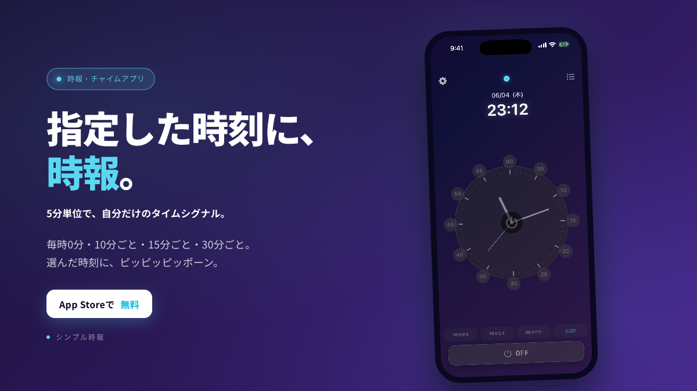
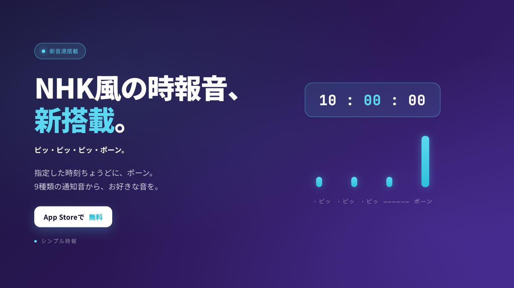
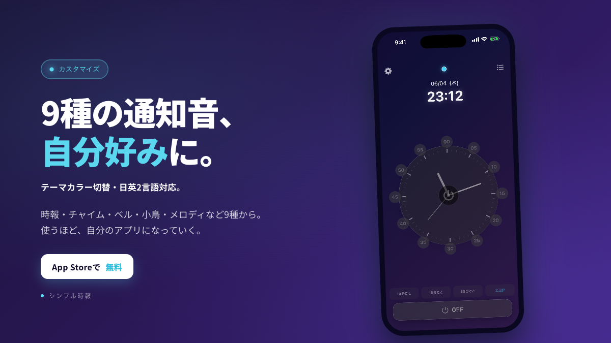

# シンプル時報 v2.1 — X 投稿下書き

App Store: https://apps.apple.com/jp/app/id6740054621
画像（各1200×675・写真アプリ「シンプル時報 告知 v2.1」アルバムに保存）:
- `ts_g1.png` — メイン：指定した時刻に、時報。
- `ts_g2.png` — 新音源：NHK風の時報音、新搭載。
- `ts_g3.png` — カスタマイズ：9種の通知音、自分好みに。

---

## 下書き①（推奨・軸）コア機能　＋ `ts_g1.png`

🔔 無料アプリ「シンプル時報」公開中

指定した時刻に、ピッピッピッポーン。5分単位で、自分だけのタイムシグナルを。
毎時0分・10分ごと・15分ごと・30分ごとから自由に組み合わせ。

https://apps.apple.com/jp/app/id6740054621
#iOSアプリ #時報 #個人開発

---

## 下書き② 新音源　＋ `ts_g2.png`

🆕 v2.1 アップデート

NHKラジオ風の時報音を新搭載しました。「ピッ・ピッ・ピッ・ポーン」の本格スペック。指定時刻ちょうどにポーン音が鳴るよう、配信タイミングも自動調整。

https://apps.apple.com/jp/app/id6740054621
#iOSアプリ #時報 #NHK

---

## 下書き③ カスタマイズ　＋ `ts_g3.png`

🎶 9種類の通知音から、お好みで。

時報・チャイム・ベル・小鳥のさえずり・メロディ・音叉ベルなど、シーンに合わせて選べます。テーマカラー切替・日英2言語対応。

無料・広告なし。

https://apps.apple.com/jp/app/id6740054621
#iOSアプリ #時報

---

### 投稿時の注意（@jouji_ai 運用ルール）
- 自動投稿・自動いいね/RT/フォロー禁止（凍結歴あり）
- 1日2〜4ポストまで、間隔を空ける
- 画像内テキストは日本語のみ、数字はカンマなし

### 制作メモ
- 紫グラデのダーク基調でアプリ世界観継承（アクセント = アプリのシアン #5BD8F0）
- 実機スクショ（home_dark.png 1320×2868）を 280×608 のiPhone枠で表示
- g2のみ装飾オブジェクト（時刻チップ＋音波形）を採用、g1/g3 は実機主役
- 詩的コピー回避・機能を直接訴求（visual-design-craft スキル準拠）
- ソース：`x-post-v1.html`
